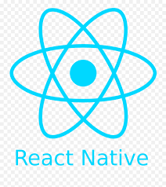
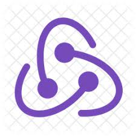

# Hola 👋, soy Thomas Rey 

## ¿Quien soy? 🧑

Como Full Stack Web Developer, tengo una sólida experiencia en el desarrollo web, con enfoque tanto en Front-End como en Back-End. Mi dominio se extiende a lenguajes de programación como JavaScript y TypeScript, los cuales he aplicado con éxito en proyectos con impacto real.

Tengo experiencia en el desarrollo Front-End con frameworks como React.js, Vite.js y Next.js, empleando Redux Toolkit para la gestión del estado y preprocesadores CSS como Sass y Less, junto con frameworks de estilos como Bootstrap y Tailwind. En el ámbito Back-End, me especializo en bases de datos SQL, principalmente PostgreSQL con Sequelize, construyendo sistemas robustos en Node.js y Express, como un comercio electrónico que trascendió lo académico convirtiéndose en una plataforma real para una boutique.

Comence a interesarme en el mundo IT desde muy pequeño, siempre senti curiosidad se saber como funcionan las cosas, en el momento que tome la decision de iniciar en este mundo fue durante la pandemia, momento en que me encontraba estudiando Ingenieria en Sistemas, debido a la situacion compleja y que sentia que la carrera no me estaba dando lo que yo personalmente queria, aprender programacion orientada al desarrollo de aplicaciones y SPA, decidi comenzar diferentes cursos en los cuales aprendi varias de las tecnologias mas utilizadas del mercado.

Destaco por mi capacidad para trabajar en equipo, algo que he cultivado a través de estos proyectos, donde además he tenido la oportunidad de liderar iniciativas clave que impulsaron el éxito del equipo, por ser resolutivo, curioso y adaptable, con la habilidad de absorber rápidamente nuevas tecnologías y enfrentar desafíos con creatividad. Estoy siempre dispuesto a escuchar y aprender, buscando oportunidades para aplicar mis habilidades técnicas y de liderazgo en entornos desafiantes y dinámicos.

## ¿Hacia donde voy? 🌟

Como desarrollador, mi objetivo es crecer y fortalecer mis habilidades en diferentes áreas de la programación. Mis metas y direcciones futuras incluyen:

### Aprendizaje Continuo 📚

Estoy comprometido a seguir aprendiendo nuevas tecnologías y conceptos. Mi enfoque principal actualmente está en:

- Profundizar mis conocimientos en JavaScrip y Typescript.
- Comprender y aplicar principios de bases de datos noSql.
- Explorar el desarrollo móvil, posiblemente a través de Flutter o React Native.

### Colaboración y Experiencia Práctica 🤝

Busco oportunidades para colaborar en proyectos desafiantes que me permitan trabajar en equipo y aprender de otros desarrolladores. Estoy abierto/a a:

- Contribuir en proyectos de código abierto para ampliar mi experiencia.
- Trabajar en entornos donde pueda recibir retroalimentación constructiva para mejorar constantemente.

### Desarrollo Profesional 💼

Mi meta a largo plazo es convertirme en un desarrollador sólido y versátil, capaz de abordar problemas complejos y ofrecer soluciones innovadoras. Para lograr esto, planeo:

- Buscar oportunidades de mentoría para crecer profesionalmente.
- Continuar mi educación formal o buscar certificaciones relevantes.

Estoy emocionado/a por el viaje que me espera en el mundo del desarrollo de software y estoy ansioso/a por aprender y crecer cada día más.

## ¿Que tecnologias uso? 💻

    
    
    
    
    
    
    
    
    
    
    
    
    
    
    
    
    

## No dudes en contactarme! 📧

-Te aseguras en tu equipo tener una persona apasionada por este mundo, autonoma, resolutiva, creativa y con capacidad de trabajar en equipo!

Email: thomas_rey1999@otulook.com

Linkedin: https://www.linkedin.com/in/thomas-rey-39099021b

