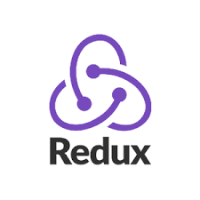

# Hola 👋, soy Thomas Rey 

## ¿Quien soy? 🧑

Como Full Stack Web Developer, tengo una sólida experiencia en el desarrollo web, con enfoque tanto en Front-End como en Back-End. Mi dominio se extiende a lenguajes de programación como JavaScript y TypeScript, los cuales he aplicado con éxito en proyectos con impacto real.

En el ámbito del Front-End, he trabajado con frameworks como React.js, Vite.js y Next.js, aprovechando herramientas como Redux Toolkit para optimizar la gestión del estado. Mi destreza incluye el manejo de preprocesadores CSS como Sass y Less, así como la implementación de frameworks de estilos como Bootstrap y Tailwind para asegurar experiencias visuales atractivas y funcionales.

Mi expertise se centra en el uso de bases de datos SQL, principalmente PostgreSQL, junto con la ORM Sequelize. He desarrollado sistemas robustos utilizando Node.js y servidores con Express, contribuyendo a proyectos como un comercio electrónico de alimentos que trascendió el ámbito académico para convertirse en una web real para una boutique.

Comence a interesarme en el mundo IT desde muy pequeño, siempre senti curiosidad se saber como funcionan las cosas, en el momento que tome la decision de iniciar en este mundo fue durante la pandemia, momento en que me encontraba estudiando Ingenieria en Sistemas, debido a la situacion compleja y que sentia que la carrera no me estaba dando lo que yo personalmente queria, aprender programacion orientada al desarrollo de aplicaciones y SPA, decidi comenzar diferentes cursos en los cuales aprendi varias de las tecnologias mas utilizadas del mercado .

Fuera del mundo del código, encuentro equilibrio y creatividad en mis hobbies. Disfruto de la música y tocar la guitarra, explorando la intersección entre la técnica y la creatividad. Esta pasión también se refleja en mi creatividad para elaborar algoritmos y estilos en mis sitios web.

Destaco por mi capacidad para trabajar en equipo, algo que he cultivado a través de estos proyectos, donde además he tenido la oportunidad de liderar iniciativas clave que impulsaron el éxito del equipo.

Me caracterizo por ser resolutivo, curioso y adaptable, con la habilidad de absorber rápidamente nuevas tecnologías y enfrentar desafíos con creatividad. Estoy siempre dispuesto a escuchar y aprender, buscando oportunidades para aplicar mis habilidades técnicas y de liderazgo en entornos desafiantes y dinámicos.
Actualmente me encuentro mejorando mis habilidades y buscando mi primer oportunidad en el mundo IT.

## ¿Que hago? 👨‍💻

Actualmente me encuentro realizando proyectos freelance, aprendiendo nuevas tecnologias, reforzando mis conocimientos en busca de mi primera oportunidad en una empresa del mundo IT. 

## ¿Hacia donde voy? 🌟

Como desarrollador, mi objetivo es crecer y fortalecer mis habilidades en diferentes áreas de la programación. Mis metas y direcciones futuras incluyen:

### Aprendizaje Continuo 📚

Estoy comprometido a seguir aprendiendo nuevas tecnologías y conceptos. Mi enfoque principal actualmente está en:

- Profundizar mis conocimientos en JavaScrip y Typescript.
- Dominar los fundamentos de lenguajes como  Python y C#.
- Dominar Next js y aprender Angular para expandir mi abanico de oportunidades.
- Comprender y aplicar principios de bases de datos noSql.
- Explorar el desarrollo móvil, posiblemente a través de Flutter o React Native.
- Aprender a realizar Testing para hacer mas profesionales mis proyectos.
- Aprender a utiulizar microservicios de Google.

### Colaboración y Experiencia Práctica 🤝

Busco oportunidades para colaborar en proyectos desafiantes que me permitan trabajar en equipo y aprender de otros desarrolladores. Estoy abierto/a a:

- Contribuir en proyectos de código abierto para ampliar mi experiencia.
- Trabajar en entornos donde pueda recibir retroalimentación constructiva para mejorar constantemente.

### Desarrollo Profesional 💼

Mi meta a largo plazo es convertirme en un desarrollador sólido y versátil, capaz de abordar problemas complejos y ofrecer soluciones innovadoras. Para lograr esto, planeo:

- Buscar oportunidades de mentoría para crecer profesionalmente.
- Continuar mi educación formal o buscar certificaciones relevantes.

Estoy emocionado/a por el viaje que me espera en el mundo del desarrollo de software y estoy ansioso/a por aprender y crecer cada día más.

## ¿Que tecnologias uso? 💻

· Javascript

· Typescript

· HTML 5

· CSS 3

· SASS

· Next js

· React js

· React Native

· Redux Toolkit 

· Node js

· express

· SQL

· Postgresql

· Sequelize

·Bootstrap

·Tailwind

·Ant Design

## No dudes en contactarme! 📧

-Te aseguras en tu equipo tener una persona apasionada por este mundo, autonoma, resolutiva, creativa y con capacidad de trabajar en equipo!

Email: thomas_rey1999@otulook.com

Linkedin: https://www.linkedin.com/in/thomas-rey-39099021b

